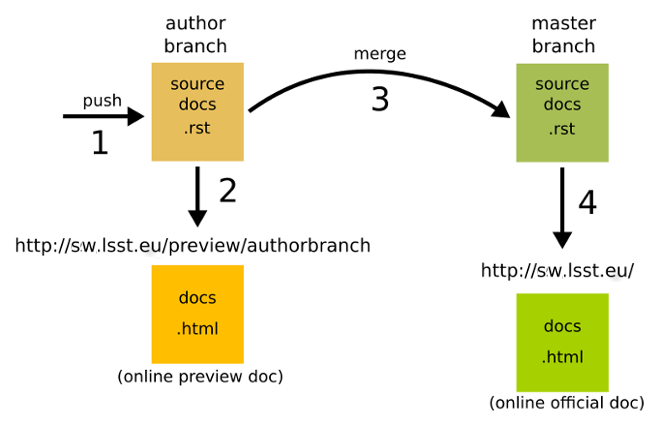

LSST FRANCE DOCUMENTATION
=========================

<br />

Introduction
----------
***

This repository contains LSST documentation sources (reStructuredText file format).  
Updating content on this repository automatically generates and publishes online documentation.

<br />

Goals
----------
***

- Manage collaboration between LSST documention's authors
- Generate & Publish LSST Documentation

<br />

Workflow
----------
***

Each author works on his own branch and can see a preview at every push.  
Once the author is satisfied, he can merge his branch with the master branch.  
The merge in master generates and publishes the official version.  
This repository only contains source documentation (.rst files).  
Authors must write documentation respecting this format.  
More info on the reStructuredText (rst) file format: https://en.wikipedia.org/wiki/ReStructuredText  



### master branch is the official doc that is pushed online at http://sw.lsst.eu/.  
### Documentation generation and uploading is fully automated.  

<br />

Instructions
----------
***

**Step1**: clone the repo and create your own branch from master

```bash
git clone git@gitlab.in2p3.fr:brigaud/sw-lsst-eu.git
cd sw-lsst-eu
git checkout -b <yourbranch>
```

**Step2**: create/modify your doc in your branch then push it

```bash
git add --all
git commit -m "your changes comments"
git push
```
... wait about a minute and check it out at http://sw.lsst.eu/preview/\<yourbranch\>.

<br />

> **Note:**

> - Each push on your branch will generate a documentation at http://sw.lsst.eu/preview/\<yourbranch\>
> - Useful for preview.

<br />

**Step3**: send a merge request to master branch to put documentation in production
<br /><br />
https://gitlab.in2p3.fr/brigaud/sw-lsst-eu/merge_requests/new?merge_request%5Bsource_branch%5D=\<yourbranch\>
<br /><br />
An administrator will check your version, fix conflicts and finally merge your branch into master branch.<br />
This merge will automatically trigger the build process and update the official documentation at http://sw.lsst.eu/.

<br />

> **Note:**

> - Each merge on master branch will generate a documentation at http://sw.lsst.eu

<br />

> **Important**:

> - Each time master builds a new official doc, preview folder (i.e http://sw.lsst.eu/preview) is deleted

<br />

Recommandations
--------------------
***

All the documentation resides in the "docs" folder.  
You can create or delete files and folders in order to create your documentation.  
Be sure to update the index.rst file in case you add or delete documentation files or folders in order to access it from the sidebar menu on the website.

<br />

> **Note:**

> - As a community project, it is recommended to work only on parts you've been assigned
> - Keep as much as possible the original tree structure
> - Keep as much as possible your branch up-to-date with respect to master branch (i.e git rebase master <yourbranch>)

<br />

Happy doc!
