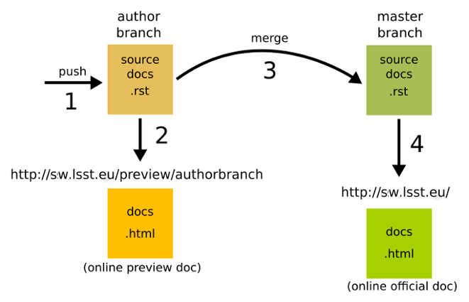

# Developer documentation

This document contain instructions on how to trigger the continuous integration machinery for building the documentation of
site [https://sw.lsst.eu](https://sw.lsst.eu).

The sources of the documentation are located in the `docs` directory of this repository. To build them do:

```bash
git clone git@gitlab.in2p3.fr:brigaud/sw-lsst-eu.git
cd sw-lsst-eu
git checkout -b <yourbranch>
```

The last step, i.e. creating your own branch is very important. You can now modify the contents of your local copy of the files in the `docs` directory and commit your changes. Then do:

```bash
git push
```

This push operation will trigger the CI infrastructure. You can preview the modified version of the documentation at the address: `https://sw.lsst.eu/preview/<yourbranch>`.

Once you are happy with your modifications and want to push them in production make a merge request via the command line or by visiting:

```
https://gitlab.in2p3.fr/brigaud/sw-lsst-eu/merge_requests/new?merge_request%5Bsource_branch%5D=<yourbranch>
```

You can have an overview of the process in the diagram below:

